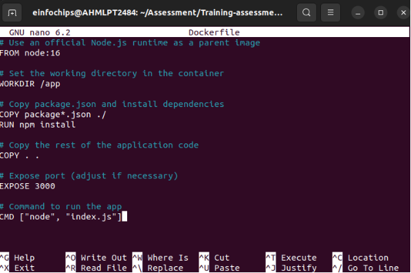
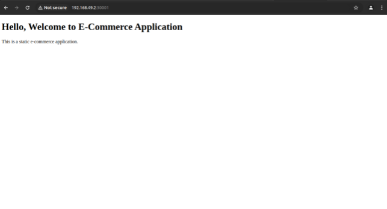

**Assessment: Use Case Oriented Project**

**Project Overview**

You are tasked with setting up a CI/CD pipeline for a microservices-based application. The application will be containerized using Docker and orchestrated using Kubernetes. Ansible will be used for configuration management and deployment. The entire setup should be managed using Git for version control, and Jenkins will be used to automate the CI/CD process.

**Use Case Scenario**

Your company is developing a new e-commerce application consisting of several microservices: a front-end service, a product catalog service, and an order processing service. The goal is to automate the deployment and configuration of these services across development, testing, and production environments using Ansible, Docker, Kubernetes, and Jenkins.

**Task 1: Git Repository Setup**

1. Created a Git repository to store all project files, including Dockerfiles, and Kubernetes manifests.
1. Branching Strategy:
- Created branches for development, testing, and production

**Task 2: Dockerize Microservices**

1. Created Dockerfiles for each microservice (front-end, product catalog, order

processing). 

2. Built Docker images for each microservice and pushed them to a container registry(Docker Hub).
2. Deliverables:
- Dockerfiles for each microservice
- Built Docker images in a container registry

**Front-end Dockerfile**

Dockerhub link: https://hub.docker.com/repository/docker/poonam02/front-end/general

**Product-catalog Dockerfile**

Dockerhub link: https://hub.docker.com/repository/docker/poonam02/product-catalog/general

**Order-processing Dockerfile**

Dockerhub link: https://hub.docker.com/repository/docker/poonam02/order-processing/general

**Task 3: Kubernetes Deployment**

1. Created Kubernetes manifests for deploying each microservice.
1. Deployed the microservices to a Kubernetes cluster.
1. Deliverables:
- Kubernetes manifests (YAML files)
- Successful deployment of microservices in the Kubernetes clusterproduction.

**Kubernetes Manifests frontend-deployment.yaml**

**order-processing-deployment.yaml**

**product-catalog-deployment.yaml**

